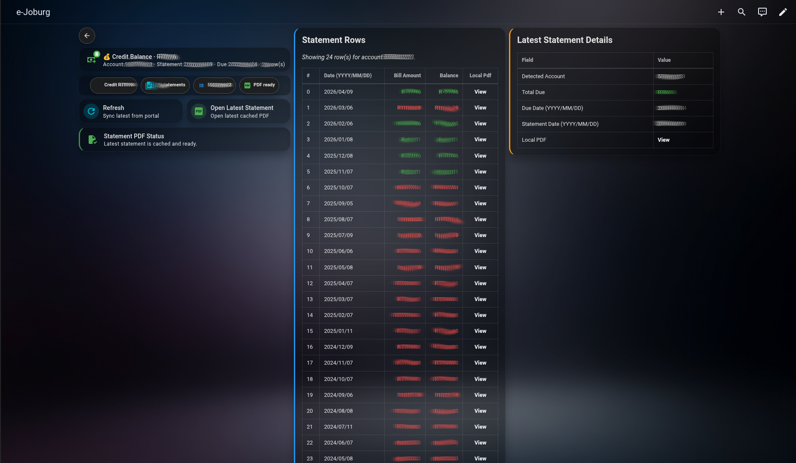
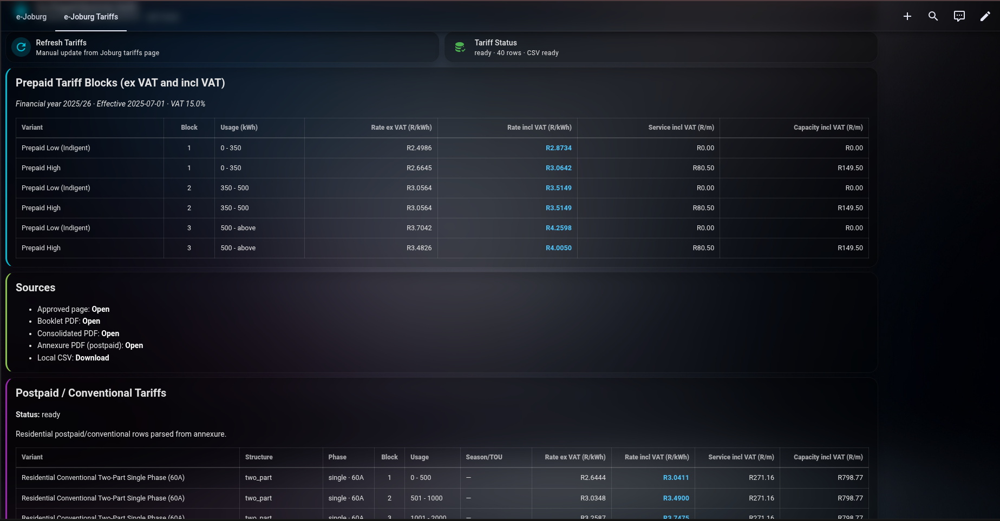

  

<h1 align="center">e-Joburg Bridge</h1>

  Home Assistant custom integration for the City of Johannesburg e-Joburg portal.

  
  

## Dashboard Preview

Sample dashboard YAML:

- `examples/ejoburg-example.yaml`

## What It Does

- Logs in to `https://www.e-joburg.org.za` (JSF flow) and retrieves account data.
- Fetches account overview, payment history summary, and statement history rows.
- Downloads statement PDFs, caches them locally, and exposes local PDF links.
- Parses statement PDFs for key values (amount due, due date, statement date).
- Exposes Home Assistant sensors/buttons for dashboard and automation use.

## Install

### HACS

1. Open HACS.
2. Go to `Custom repositories`.
3. Add `https://github.com/defria/ejoburg-bridge` as type `Integration`.
4. Install `e-Joburg Bridge`.
5. Restart Home Assistant.
6. Go to `Settings -> Devices & Services -> Add Integration`.
7. Search for `e-Joburg Bridge` and complete setup.

### Manual

1. Copy `custom_components/ejoburg_bridge` to `/config/custom_components/ejoburg_bridge`.
2. Restart Home Assistant.
3. Add from `Settings -> Devices & Services -> Add Integration`.

## Dashboard Example

The repository includes a shareable dashboard template:

- `examples/ejoburg-example.yaml`

It is ready for sharing and can be adapted to your preferred account display style.

When sharing screenshots/examples publicly, use generic placeholders (for example,
`john.doe@example.com`, `12345`) instead of real account identifiers.

### Dashboard dependencies

Install these from HACS Frontend before importing the example dashboard:

- [Mushroom Cards](https://github.com/piitaya/lovelace-mushroom)
  - `custom:mushroom-template-card`
  - `custom:mushroom-chips-card`
- [card-mod](https://github.com/thomasloven/lovelace-card-mod)

### Import dashboard example

1. Install the dashboard dependencies above.
2. Open `examples/ejoburg-example.yaml` and copy its contents.
3. In Home Assistant, edit your dashboard in YAML mode and paste/adapt the view.

## Main Entities

- `sensor.e_joburg_latest_statement_amount`
- `sensor.e_joburg_statement_row_count`
- `sensor.e_joburg_latest_statement_pdf_url`
- `sensor.e_joburg_account_number_detected`
- `button.e_joburg_refresh`
- `button.e_joburg_open_latest_statement`

## Service

- `ejoburg_bridge.refresh`

Optional field:

- `entry_id`

## Polling Interval

- Configured during setup and editable later via integration options.
- Range: `1440` to `44640` minutes.
- Typical values:
  - Daily: `1440`
  - Weekly: `10080`
  - Monthly: `43200` (30 days) or `44640` (31 days)

## Detailed Docs

- `custom_components/ejoburg_bridge/README.md`
- `docs/prepaid-electricity-coj.md`
- `data/coj_prepaid_electricity_tariffs_2025_26.csv`

## Tariffs (manual-first)

- Tariff schedules are downloaded once and cached locally (no periodic polling).
- Manual refresh is available via `button.e_joburg_refresh_tariffs` and `ejoburg_bridge.refresh_tariffs`.
- Tariffs dashboard view is available in `examples/ejoburg-example.yaml` and local dashboard at `ejoburg.yaml`.
- Postpaid/conventional tariffs are parsed from the approved annexure (`ITEM_03C_ANNEXURE.pdf`) and shown in a dedicated postpaid table.

## Legal Notice

- This is an independent hobby project for educational/personal use.
- It is not affiliated with, endorsed by, or sponsored by the City of Johannesburg.
- "City of Johannesburg", "e-Joburg", and related names/logos are the property of their respective owners.
- All rights to third-party marks, names, and branding remain with their owners.
- Use the official portal for authoritative account records: https://www.e-joburg.org.za/
